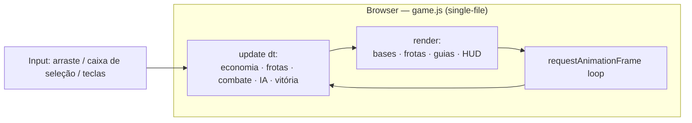

# 03 — Arquitetura Técnica

## Visão geral (protótipo atual)



Hoje **sim e render vivem no mesmo arquivo** (`game.js`) — deliberado, pela velocidade de iteração. O **alvo** (F1) separa a simulação pura.

## Estrutura

**Atual (single-file):**
```
proto-conquista/
├── index.html      # canvas + <script src=game.js>
├── game.js         # estado + loop + sim + IA + input + render (~310 linhas)
└── docs/
```

**Alvo (graduação F1 — espelha project-football/interregno):**
```
conquista/
├── packages/
│   ├── sim/        # simulação determinística PURA (bases, frotas, combate, IA)
│   │               #   sem render, sem Math.random/Date.now, PRNG injetado
│   └── shared/     # tipos + config de balanceamento (os "diais")
├── apps/
│   └── web/        # Vite + Canvas/Phaser: só render + input (consome a sim)
└── docs/
```

## Modelo de estado

- **`nodes[]`** — bases: `{ owner: you|enemy|neutral, troops, tier, prod, cap, radius, x, y }`.
- **`fleets[]`** — frotas em trânsito: `{ owner, x, y, target, count }`.

## Simulação (`update(dt)`)

1. **Economia:** bases não-neutras crescem `prod*dt` até `cap`; neutras são estáticas até capturadas.
2. **Movimento de frotas:** velocidade fixa (`CFG.fleetSpeed`) rumo ao alvo → **a geometria importa** (reforço distante chega tarde).
3. **Combate na chegada:** mesma cor = reforço (soma); cor diferente = subtrai; se a defesa fica negativa, a base **vira** do atacante com o excedente.
4. **Vitória:** sem bases nem frotas de um lado → fim de partida.

## IA (`aiThink`, por ticks de `CFG.aiTick`)

Heurística determinística, **sem trapaça** (mesmas regras do jogador):
- **Defesa:** base com ataque entrante > guarnição puxa reforço do vizinho forte mais próximo.
- **Ataque/expansão:** base com excedente mira o alvo de melhor *score* (tier alto, defesa baixa, perto, bônus por bater no jogador) que ela **consegue tomar**.
- **Economia:** às vezes faz upgrade de uma base segura da retaguarda.

> Armadilha futura (lição do project-football): ao graduar pro modelo autoritativo, **a render nunca decide regra**. Bug de posição/estado quase sempre é da camada de render, não da sim.

## Render (`render`)

Canvas 2D puro, **zero asset**: grid sutil, bases como círculos com *glow* (cor = dono, tamanho = tier, número = tropas), frotas como setas, anel tracejado vermelho = base sob ataque, guias do(s) selecionado(s) até o mouse, HUD. Toda a "arte" é geometria + luz (ver [ADR-0002](decisions/ADR-0002-arte-procedural-sem-modelagem.md)).

## Balanceamento (diais)

`CFG` (velocidade de frota, tick da IA) e `TIERS` (prod/cap/raio por nível) no topo de `game.js`. **Alvo:** mover pra `packages/shared` como config tipada testável por seed.

## Pendências de arquitetura (dívida do protótipo)

- Separar **`packages/sim` puro** (sim sem render) — habilita golden replays.
- Trocar `Math.random`/`performance.now` por **PRNG seedado + clock injetado** dentro da sim.
- Testes: Vitest + fast-check (invariantes: conservação de tropas, captura) + golden replays por seed.
